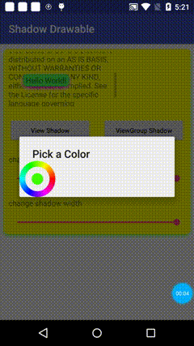

# Shadow Drawable
A rounded rectangle drawable which also includes a shadow around.

[](https://www.apache.org/licenses/LICENSE-2.0)

 Android 卡片阴影背景图

## 预览


## 1.功能
 * CardView阴影效果不能很好的满足设计师的需求，所以对support v7包中的RoundRectDrawableWithShadow文件做了一些修改，现在可以更灵活地改变卡片的阴影效果。


## 2.代码演示 也可参考demo中的代码

### 调用
```java

    View  hello = findViewById(R.id.tv_hello);
            RoundRectDrawableWithShadow shadow1 = new RoundRectDrawableWithShadow(getResources(),
                    ColorStateList.valueOf(selectedColor), 8, 8);

                    roundRectDrawableWithShadow.setShadowStartColor(0x8800FF00);
                    roundRectDrawableWithShadow.setShadowEndColor(0x00FFFFFF);

    //更多方法调用详见sample

```

License
--------

    Copyright 2017 kevin.

    Licensed under the Apache License, Version 2.0 (the "License");
    you may not use this file except in compliance with the License.
    You may obtain a copy of the License at

       http://www.apache.org/licenses/LICENSE-2.0

    Unless required by applicable law or agreed to in writing, software
    distributed under the License is distributed on an "AS IS" BASIS,
    WITHOUT WARRANTIES OR CONDITIONS OF ANY KIND, either express or implied.
    See the License for the specific language governing permissions and
    limitations under the License.
